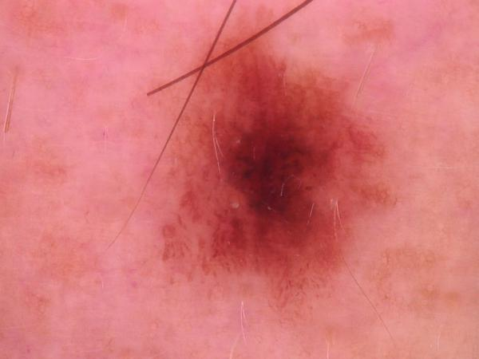
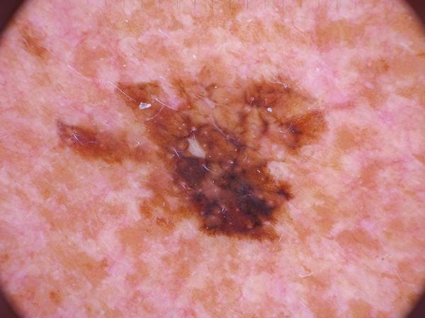
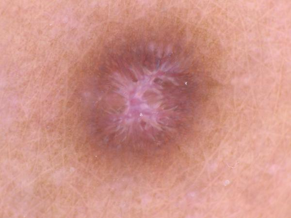
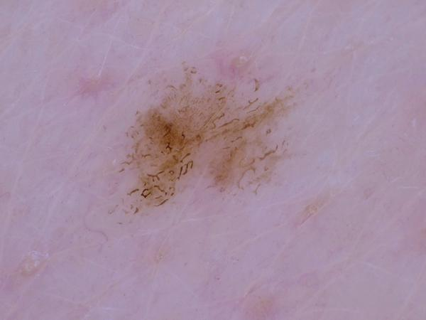
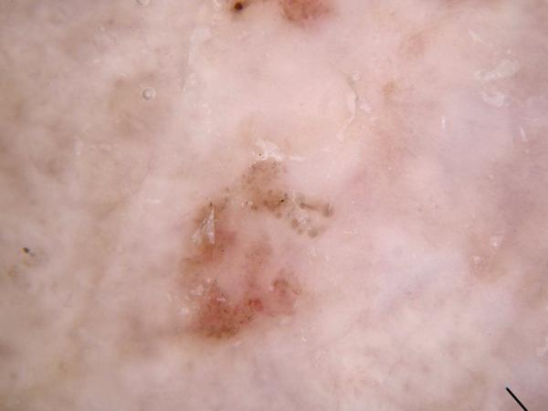
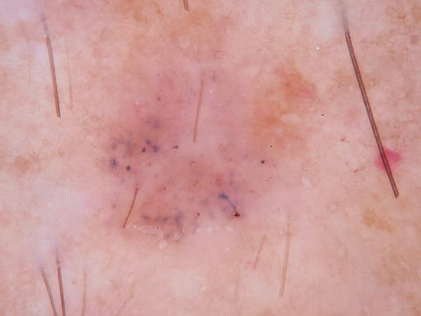
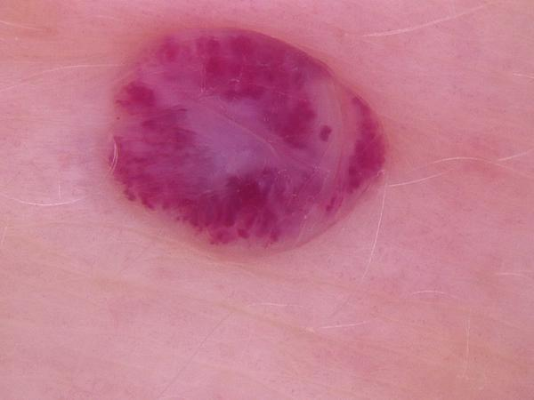

This project implemenst a machine learning model to classify diffrent diagnosis of skin lessions.
The dataset used for this project, HAM-10000, is property of the ISIC-Archive.

The machine learning model implemented here is a CNN, built using tensorflow-keras functional api.

The model obtained from trainning is used in web app implemented using google cloud platform CLI, and FLASK.
Here you can watch the project running: https://skincancerapp-935771581787.northamerica-south1.run.app

The model is able to classify between 8 kinds of skin lessions:
- actinic keratosis

- basal cell carcinoma

- dermatofibroma

- melanoma

- nevus

- pigmented benign keratosis

- squamus cell carcinoma

- vascular lesion

